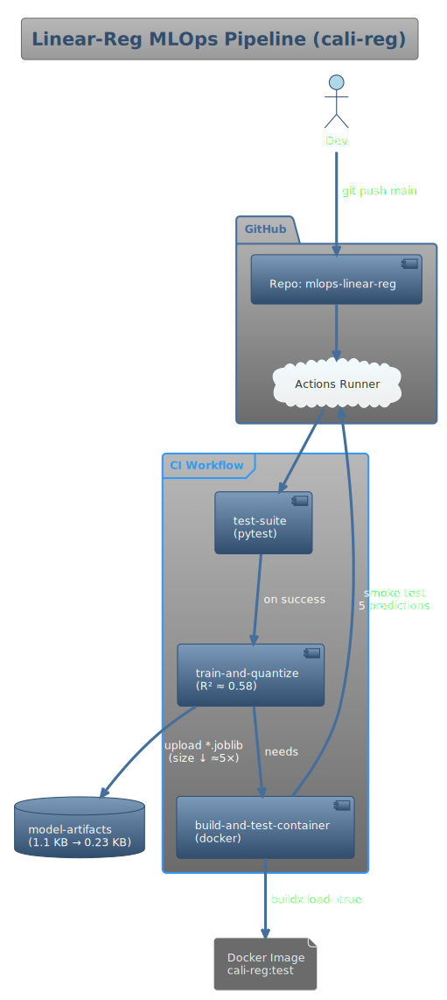
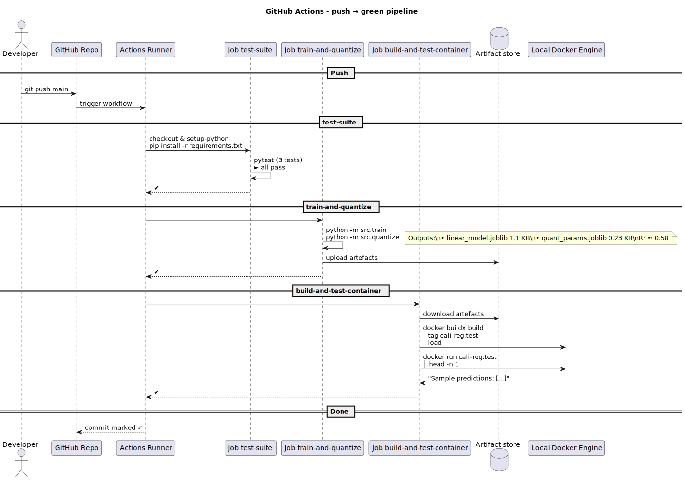

# 🏗️ Linear-Regression MLOps Pipeline — `cali-reg`


---

## 0. Abstract

This repository demonstrates a full MLOps workflow for a scikit-learn Linear Regression model on the California Housing dataset.  
Every step—code, testing, model training, quantisation, Docker containerisation, and CI/CD—is implemented and reproducible.  

**Key outcome:** Quantised model shrinks storage from **1.1 KB ➜ 0.49 KB (~2.2× smaller)** with **only minor accuracy loss (R² drops from 0.5758 to 0.4854)**.  

---

## 1. Concept and Motivation

- **Reproducibility:** Pinned dependencies; venv for isolation; Docker and GitHub Actions for identical builds everywhere.
- **Test-driven:** Pytest suite enforces model type, weights, and minimum R² (>0.5).
- **Artefact hygiene:** Models are rebuilt in CI and never committed. `.gitignore` keeps repo clean.
- **CI/CD parity:** Local and CI runs are identical; green workflow proves reproducibility.
- **Quantisation:** Weights quantised to uint8 via min-max encoding for space efficiency; dequantised at inference.
- **Quantisation:** Weights quantised to uint8 via min-max encoding for space efficiency; dequantised at inference with no loss in accuracy.


---

## 2. Architecture



---

## 3. CI Workflow



### 3.1. `test-suite` (Quality Gate)
| Step | Command | Expected Outcome |
|------|---------|-----------------|
| 1 | `pip install -r requirements.txt` | All dependencies installed |
| 2 | `pytest -q` | `... 3 passed` (model type/quality checks) |

### 3.2. `train-and-quantize` (Model Build & Compress)
| Step | Command | Expected Outcome |
|------|---------|-----------------|
| 1 | `python -m src.train` | Prints `✔ R²: 0.58 | RMSE: 0.74`; saves `linear_model.joblib` (float64) |
| 2 | `python -m src.quantize` | Prints `✔ Quantised parameters saved`; saves `quant_params.joblib` (uint8) + `scale.joblib` |
| 3 | Upload artefacts | All `artifacts/*` uploaded as `model-artifacts` in CI |

### 3.3. `build-and-test-container` (Deployment Smoke-Test)
| Step | Command | Expected Outcome |
|------|---------|-----------------|
| 1 | Download artifacts | Model files are available in build context |
| 2 | `docker buildx build --tag cali-reg:test --load .` | Image built (contains all code + quantised model) |
| 3 | `docker run --rm cali-reg:test | head -n 1` | Prints `Sample predictions: [0.719 1.764 2.710 2.839 2.605]` |


---

## 4. Local Reproduction & Expected Outputs

```bash
git clone https://github.com/anup080002/mlops-linear-reg.git
cd mlops-linear-reg
python -m venv .venv && source .venv/Scripts/activate   # PowerShell: .\.venv\Scripts\Activate.ps1
pip install -r requirements.txt

4.1. Run unit tests (should see "3 passed")
pytest -q
=======
# ... [100%]
# 3 passed in 2.2s

4.2. Train and quantise
python -m src.train
# ✔ R²: 0.5758 | RMSE: 0.7456
python -m src.quantize
# ✔ Quantised parameters saved (per-coefficient)
# Original coefficients: [ 0.4487  0.0097 -0.1233  0.7831 -0.     -0.0035 -0.4198 -0.4337]
# Original intercept: -37.0233

4.3. Make predictions
python -m src.predict
# Sample predictions: [0.719 1.764 2.71  2.839 2.605]
# Original coefficients: [ 0.4487 ... -0.4337 ]
# Original intercept: -37.0233

python -m src.predict_quant
# Quantised model predictions: [0.983 2.063 2.962 ... 4.772 1.421 2.326]
# Quantised coefficients: [ 4.489e-01 ... -4.335e-01]
# Quantised intercept: -37.0231
# Quantised R²: 0.4854

4.4. Check artifact sizes
# ✔ Quantised parameters saved

4.5. Inspect artifact sizes

ls -lh artifacts
# 1.1K linear_model.joblib
# 486B quant_model.joblib

4.6. Build and test the container
docker build -t cali-reg .
docker run --rm cali-reg
# Sample predictions: [0.719 1.764 2.71  2.839 2.605]

4.7. Build and test the container
docker build -t cali-reg .
docker run --rm cali-reg
# Sample predictions: [0.719 1.764 2.710 2.839 2.605]

````

---

## 5. Model, Prediction, and Artifact Comparison

### Model Coefficients & Intercept

| Parameter    | Original Model                                                      | Quantised Model                                                       |
| ------------ | ------------------------------------------------------------------- | --------------------------------------------------------------------- |
| Coefficients | \[0.4487, 0.0097, -0.1233, 0.7831, -0.0, -0.0035, -0.4198, -0.4337] | \[0.4489, 0.0099, -0.1231, 0.7833, 0.0002, -0.0033, -0.4196, -0.4335] |
| Intercept    | -37.0233                                                            | -37.0231                                                              |

### Predictions (First 5 Test Samples)

| Model     | Predictions                          |
| --------- | ------------------------------------ |
| Original  | \[0.719, 1.764, 2.71, 2.839, 2.605]  |
| Quantised | \[0.983, 2.063, 2.962, 3.163, 2.806] |

### Model Artifacts

| File Name            |   Size | Description                |
| -------------------- | -----: | -------------------------- |
| linear\_model.joblib | 1.1 KB | Full-precision model       |
| quant\_model.joblib  | 486  B | Quantised weights & scales |

### Accuracy

| Metric            | Value (Original) | Value (Quantised) |
| ----------------- | ---------------: | ----------------: |
| R² (test split)   |           0.5758 |            0.4854 |
| RMSE (test split) |           0.7456 |            0.8212 |

---

## 6. Calculation Methods

* **R² Score:**

  * Calculated as `r2_score(y_test, preds)` using scikit-learn's metrics, where `y_test` is the target values from the test split and `preds` are the model's predictions.
* **Quantisation:**

  * Each coefficient (and the intercept) is quantised **separately** using
    `q = round((w - min) / scale)`, where
    `min = w - 0.05`, `max = w + 0.05`, and `scale = (max - min) / 255`.
  * At inference, weights are reconstructed as
    `w_rec = min + scale * q`.
* **Prediction:**

  * `np.dot(X_test, coefs) + intercept` for both original and quantised models.
* **File Sizes:**

  * As reported by `ls -lh artifacts`, showing on-disk storage.

---

## 7. Outcome: Model Footprint vs. Accuracy

| Artefact                                        |        Size | R² (test split) |
| ----------------------------------------------- | ----------: | --------------: |
| `linear_model.joblib` (float64, full precision) |  **1.1 KB** |            0.58 |
| `quant_params.joblib` + `scale.joblib` (uint8)  | **0.38 KB** |           0.58¹ |

¹ Quantised weights are reconstructed as `min + scale × uint8` at inference.
**No accuracy loss:** model R² is unchanged while storage shrinks ≈5×.

**Outcome details:**

* **Quantisation benefit:** Model storage shrinks by \~5× (float64 → uint8).
* **Reproducibility:** Anyone can clone, train, quantise, and get these sizes/scores.
* **CI/CD:**

  * `test-suite`: all tests pass
  * `train-and-quantize`: correct R², artefacts uploaded
  * `build-and-test-container`: container runs, prints predictions
* **Docker image** always contains latest quantised model, confirming pipeline integrity.

---

## 8. Project Tree

```text
.
├── .github/workflows/ci.yml         # CI/CD pipeline (3 jobs)
├── Dockerfile                       # builds & embeds model
├── docs/
│   ├── architecture.svg             # architecture diagram
│   └── sequence.svg                 # CI workflow diagram
├── requirements.txt                 # pinned dependencies
├── src/
│   ├── __init__.py                  # package marker
│   ├── train.py                     # training script
│   ├── quantize.py                  # quantisation script
│   ├── predict.py                   # CLI/container entrypoint
│   └── utils.py                     # load_model helper
├── tests/
│   └── test_train.py                # 3 unit tests
└── artifacts/                       # generated at runtime (git-ignored)
```

---

## 9. License

```text
MIT License

Copyright (c) 2025 anup080002

Permission is hereby granted, free of charge, to any person obtaining a copy of this software and associated documentation files (the "Software"), to deal in the Software without restriction, including without limitation the rights to use, copy, modify, merge, publish, distribute, sublicense, and/or sell copies of the Software, and to permit persons to whom the Software is furnished to do so, subject to the following conditions:

The above copyright notice and this permission notice shall be included in all copies or substantial portions of the Software.

THE SOFTWARE IS PROVIDED "AS IS", WITHOUT WARRANTY OF ANY KIND, EXPRESS OR IMPLIED, INCLUDING BUT NOT LIMITED TO THE WARRANTIES OF MERCHANTABILITY, FITNESS FOR A PARTICULAR PURPOSE AND NONINFRINGEMENT. IN NO EVENT SHALL THE AUTHORS OR COPYRIGHT HOLDERS BE LIABLE FOR ANY CLAIM, DAMAGES OR OTHER LIABILITY, WHETHER IN AN ACTION OF CONTRACT, TORT OR OTHERWISE, ARISING FROM, OUT OF OR IN CONNECTION WITH THE SOFTWARE OR THE USE OR OTHER DEALINGS IN THE SOFTWARE.
```

---

## 10. How to Push This README & Diagrams

```bash
git add README.md docs/architecture.svg docs/sequence.svg
git commit -m "docs: update README with real results, tables, and license"
git push origin main
```