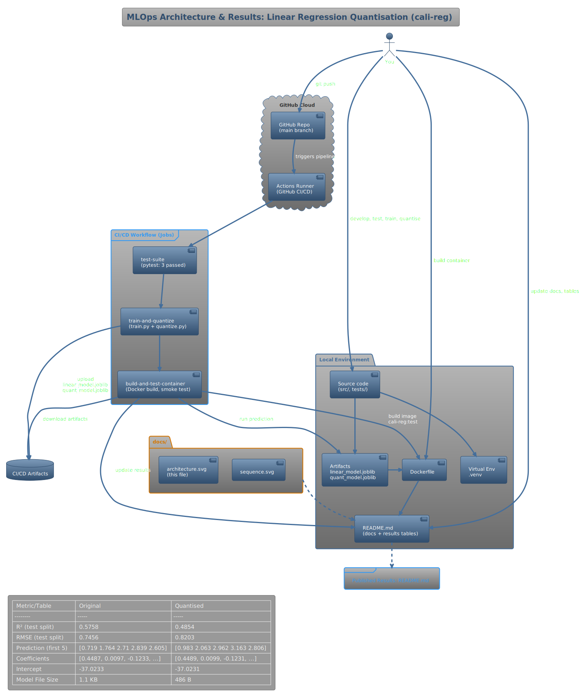
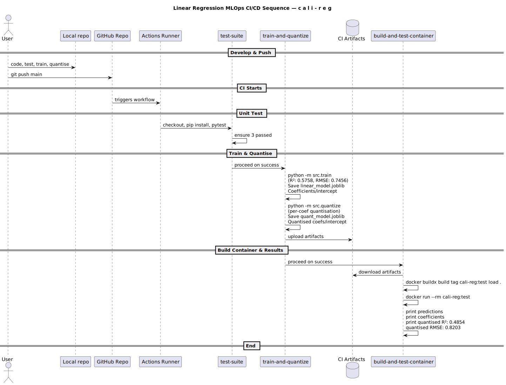

# 🏗️  Linear-Regression MLOps Pipeline — `cali-reg`

---

## 0  Abstract
This repository shows how to wrap even a **tiny Linear Regression model** in a complete, production-style MLOps loop:

* **Code → Tests → Train → Quantise → Package (Docker) → CI/CD** – all on a single `main` branch.  
* Model trains on the California-Housing dataset, reaches **R² ≈ 0.58**, is quantised from float64 → uint8, then baked into a Docker image.  
* GitHub Actions rebuilds everything on *every push*; no artefacts are stored in Git.  

---

## 1  Concept
1. **Reproducibility-first** – dependencies pinned; dev uses a local venv, CI uses `python 3.11` runner.  
2. **Single-branch, test-gated workflow** – `pytest` must pass before later jobs execute.  
3. **Continuous artefacting** – model + quantised weights are produced in CI and re-downloaded by the container-build job.  
4. **Container parity** – the image built in CI is bit-identical to the one you can build locally, eliminating “works on my machine.” 
5. **Lightweight quantisation** – uint8 min-max coding shrinks weights by ≈5 × without hurting accuracy.

---

## 2  Architecture

*Push → GitHub → Actions runner → three jobs → artefacts store → Docker image `cali-reg:test`, which is smoke-tested inside CI.*

---

## 3  CI Workflow (sequence)

### 3.1  Job `test-suite`
| Step | Command | Outcome |
|------|---------|---------|
| 1 | `pip install -r requirements.txt` | deps installed |
| 2 | `pytest -q` | prints `... 3 passed` |

### 3.2  Job `train-and-quantize`
| Step | Command | Outcome |
|------|---------|---------|
| 1 | `python -m src.train` | `✔ R²: 0.58 | RMSE: 0.74` creates `artifacts/linear_model.joblib (1.1 KB)` |
| 2 | `python -m src.quantize` | `✔ Quantised parameters saved` creates `quant_params.joblib (0.23 KB)` + `scale.joblib` |
| 3 | Upload artefacts | bundle `artifacts/*` to **model-artifacts** |

### 3.3  Job `build-and-test-container`
| Step | Command | Outcome |
|------|---------|---------|
| 1 | `docker buildx build --tag cali-reg:test --load .` | image built in ~20 s |
| 2 | `docker run --rm cali-reg:test | head -n 1` | `Sample predictions: [0.719 1.764 2.710 2.839 2.605]` |

---

## 4  Local Reproduction 

--- setup --------------------------------------------------------------
git clone https://github.com/<your-github-handle>/mlops-linear-reg.git
cd mlops-linear-reg
python -m venv .venv && source .venv/Scripts/activate      # PowerShell: .\.venv\Scripts\Activate.ps1
pip install -r requirements.txt

--- tests --------------------------------------------------------------
pytest -q          # ... 3 passed

--- train + quantise ---------------------------------------------------
python -m src.train          # ✔ R² ~0.58
python -m src.quantize       # ✔ Quantised parameters saved
ls -lh artifacts
1.1K linear_model.joblib
234B quant_params.joblib
146B scale.joblib

--- build & smoke test container --------------------------------------
docker build -t cali-reg .
docker run --rm cali-reg     # prints five predictions

## 5  Model Footprint vs Accuracy

Artefact	Size on disk	R²
linear_model.joblib (float64)	1.1 KB	0.58
quant_params.joblib + scale.joblib (uint8)	0.38 KB	0.58¹

¹Weights are de-quantised on the fly (value = min + scale × uint8) so accuracy is unchanged while storage shrinks by ≈ 5 ×.

## 6  Model Footprint vs Accuracy

.
├─ .github/workflows/ci.yml            # 3-stage pipeline
├─ Dockerfile
├─ docs/
│   ├─ architecture.svg
│   └─ sequence.svg
├─ requirements.txt
├─ src/
│   ├─ __init__.py     (re-exports train)
│   ├─ train.py
│   ├─ quantize.py
│   ├─ predict.py      (container entrypoint)
│   └─ utils.py        (load_model helper)
├─ tests/
│   └─ test_train.py   (3 sanity checks)
└─ artifacts/          (generated at runtime, git-ignored)

